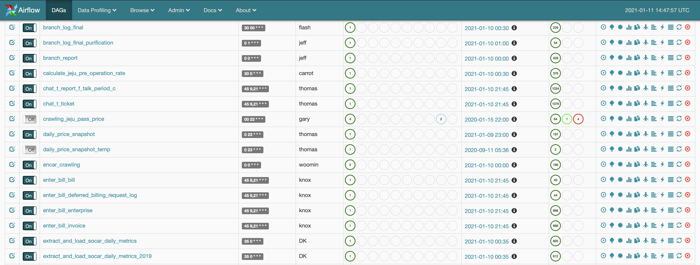
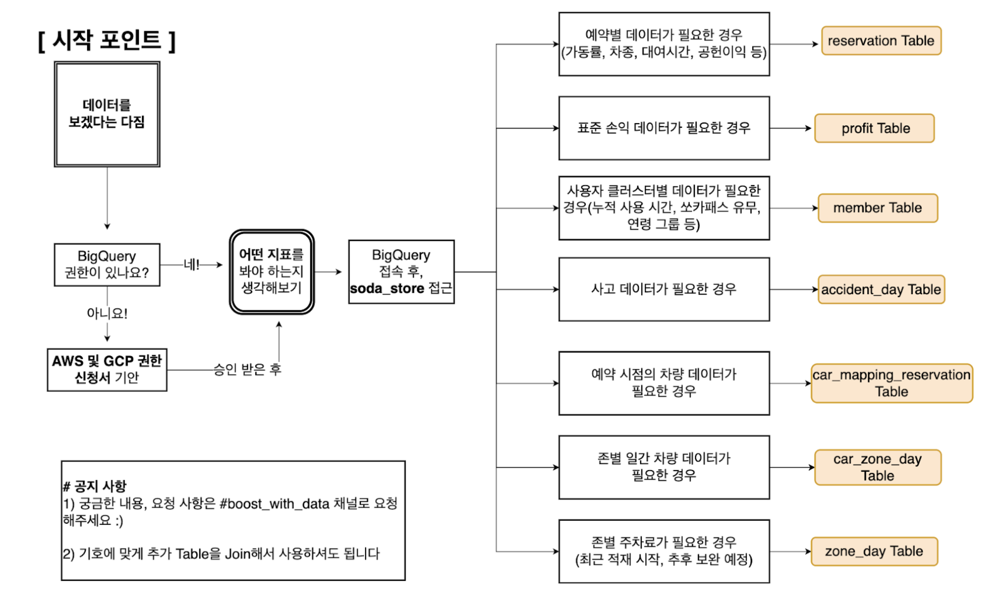
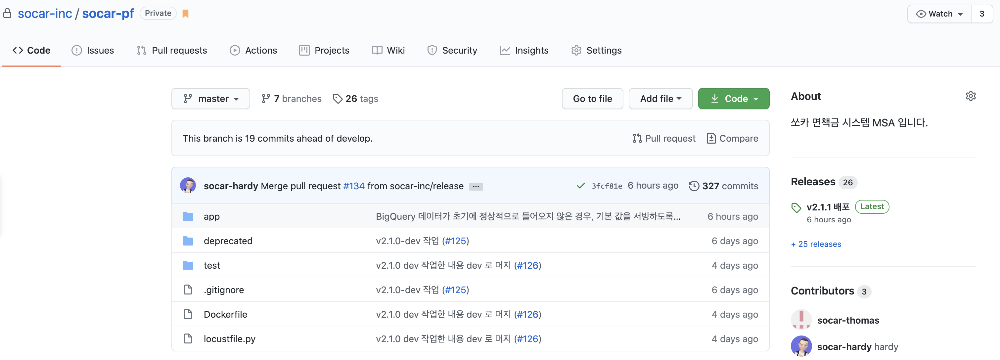

# 쏘카 데이터 엔지니어가 하는 일

안녕하세요. 데이터 엔지니어링 팀에서 이제 막 신입 1년차를 마친 하디입니다.
요즘 취업 준비하시는 분들에게 데이터 엔지니어가 되려면 어떤 걸 준비해야 하느냐는 질문을 종종 받습니다. 또, 데이터 엔지니어는 무슨 일을 하는지, 어떤 기술들을 다루는지 궁금해하시는 분들도 많은 것 같습니다.  

이번 글에서는 쏘카의 데이터 엔지니어팀은 실제로 무슨 일을 하고 있고, 어떤 이슈를 다루는 지를 소개합니다.  
기술적으로 매우 세세한 부분보다는, 전체적으로 어떤 일들을 하는지 어떤 이슈를 다루는지 위주로 적어보았습니다.
평소 데이터 엔지니어링에 대해 궁금해하시던 분들에게 도움이 되기를 바래봅니다.

## 목차

- 데이터 그룹과 데이터 엔지니어링 팀
- 데이터 엔지니어링 팀 업무
  - 자유로운 통합 데이터 분석 환경 만들기
  - 데이터 지표와 보고서 만들기
  - 데이터 기반의 백엔드 서비스 개발 및 운영
  - 데이터 그룹의 인프라/리소스 관리
- 앞으로의 목표와 해 나가야할 일들

## 데이터 그룹과 데이터 엔지니어링 팀

데이터 엔지니어링 팀을 말하기 앞서, 팀의 소속 그룹인 데이터 그룹에 대해 먼저 간략히 소개합니다.  
현재 데이터 그룹은 크게 다음과 같이 구성되어 있습니다.

- 데이터 분석 팀
    - 현업 부서의 운영을 효율화 및 자동화하기 위한 데이터 분석 및 모델링을 수행합니다.
    - 사고 리스크, 차량 파손 탐지, 보험 사기 탐지, 타다 재배치, Fleet 효율화 모델 개발 및 최적화 등을 운영하고 있습니다.
- 비즈니스 데이터 팀
    - 비즈니스 사업 분야에서의 최적의 손익을 이끌어 낼 수 있는 솔루션 제시합니다.
    - 대여 가격, 면책 요금, 타다 대리 요금 등 서비스의 요금 관련된 정책들을 분석, 의사결정 합니다.
- 데이터 엔지니어링 팀
    - 위 팀들 및 다른 부서 팀들이 손쉽게 서비스 데이터를 다루고 분석할 수 있는 기반을 마련합니다.
    - 위 팀들에 의해 만들어진 모델 혹은 비즈니스 로직을 실제로 서빙할 수 있도록 백엔드 서비스와 환경을 개발/배포 합니다.

데이터 엔지니어링 팀의 기본적인 임무는 다른 팀을 위한 "지원" 입니다. 동시에 이 지원을 어떻게 하면 효율적으로 처리시킬 수 있을 지에 대해서 고민하고 해결합니다. 여기에는 데이터 적재의 자동화, 속도와 확장 가능성을 고려한 운영, 그리고 개발과 인프라에 대한 것들이 포함되어 있습니다.

이제 데이터 엔지니어링 팀이 어떤 고민을 하고, 어떤 문제들을 풀어가는지 아래에서 살펴보겠습니다.

## 데이터 엔지니어링 팀 업무

### 자유로운 통합 데이터 분석 환경 만들기

데이터 엔지니어링팀의 첫 번째 고민은 어떻게 하면 자유로운 통합 데이터 분석 환경을 만들 수 있을 것인가에 대한 것입니다.  
보통 IT 서비스들은 서비스가 먼저 배포, 운영된 뒤에 사업적 고도화를 위해 추후 데이터 분석을 시도해보려고 합니다.  
이 때 별도의 분석 환경 없이 서비스의 데이터 저장소인 DB에 접근하여 데이터를 분석하려고 하면 크게 2가지의 이슈를 만나게 됩니다.

- 실시간으로 유저에게 서빙되고 있는 DB에 직접 접근하는 것은 위험하다.
    - 분석 중 자칫 잘못하다가 데이터를 날릴 수 있습니다.
    - 데이터를 조회하기 위해 사용하는 쿼리가 DB에 부하를 주는 경우, 운영중인 서비스의 성능에 영향을 줍니다. 
- 분석하고자 하는 데이터가 산발적으로 퍼져있어, 통합적으로 분석하기가 어렵다.
    - 예를 들어 서비스 A는 MySQL을 사용하고 있고, 서비스 B는 MongoDB를 사용하고 있는 경우, A의 데이터와 B의 데이터를 하나의 쿼리로 조회하기가 어렵습니다. 
    - 애초에 모든 서비스가 MySQL만 사용하면 되겠다고 생각할 수 있지만, 서비스를 개발할 당시에는 이런 통합 데이터 저장소를 고려하지 않는 경우가 대부분이고, 하나의 데이터 저장소만 사용해서는 안되는 경우도 존재합니다.

이 이슈들은 두 가지 필요성을 느끼게 해줍니다.

- 서비스 운영 DB가 아닌 별도의 저장소에서 분석을 해야겠다.
- 여기저기 퍼져있는 데이터들을 한 군데(별도의 저장소)로 모아야겠다.

쏘카 데이터 엔지니어링 팀은 별도의 저장소로 Google Cloud Platform의 BigQuery를 사용합니다.  
그리고 데이터를 모으는데 사용하는 워크플로우 툴로 Apache Airflow를 사용하고 있습니다.

> *** BigQuery와 Airflow를 선택한 이유는?**
>
> BigQuery는 GCP의 대용량 데이터 분석을 목적으로 나온 클라우드 서비스입니다.  
> BigQuery를 선택한 이유를 한마디로 표현하면, 당장 사용하기에 쉽고, 인프라나 운영에 신경쓸 것이 없기 때문입니다. 
> 비용도 저렴하고, 쿼리 속도도 안정적입니다.  
>
> Airflow는 Airbnb에서 만든 파이썬 기반의 배치성 파이프라인 프레임워크 입니다.  
> 비슷한 툴로는 Luigi, Argo Workflow 등이 있습니다.
> Airflow를 선택한 이유는 팀원들 대부분 파이썬에 익숙했고, Airflow로 파이프라인을 만드는데 그리 큰 시간이 들지 않았기 때문입니다.  
> 또한, Airflow는 Github에서 굉장히 많은 수의 Star를 받는 만큼, 다른 프레임워크에 비해 커뮤니티가 큽니다. 따라서, 작업하다 막힐 시에 검색을 통해 쉽게 정보를 얻을 수 있어 트러블 슈팅하는데 도움 받기가 비교적 쉽습니다.

데이터는 쏘카 내 서비스, 외부 서비스 가릴 것 없이 필요에 따라 어디서든 가져옵니다.  
특히, 쏘카 서비스는 내부적으로 MSA(Micro Service Architecture) 형태로 설계되어 있기 때문에, 서비스나 서비스의 버전에 따라 DB가 다른 경우가 종종 있습니다. 이 때문에 쿼리나 코드가 조금 복잡해지는 경우가 있는데, 이러한 부분을 모두 고려하여 데이터 엔지니어링 팀이 워크플로우 로직(Airflow의 Dag)을 설계합니다.  
필요한 데이터가 외부에 있는 경우, 크롤링 코드를 직접 작성해 데이터를 가져오기도 합니다.  

단순히 데이터를 한 군데로 모으는 것을 넘어서, 사내에서 자주 사용되는 데이터를 별도로 정제 및 집계하여 일종의 데이터 마트로 만들기도 합니다. 쏘카의 "SODA Store" 가 바로 그 대표적인 예입니다. 쏘카 서비스 내의 필요한 데이터를 찾기 위해 힘들게 모든 테이블을 살펴보지 않고, 이 SODA Store 에서 우선적으로 필요한 데이터를 찾아볼 수 있습니다. 이로 인해 데이터 탐색 시간은 줄어들고, 쿼리도 더 간결해집니다. 쏘카 직원이라면 누구나 쉽게 이 데이터 마트를 통해, 필요한 데이터를 볼 수 있습니다. 

정리하면, 데이터 엔지니어링 팀은 서비스 내 이곳저곳 에서 생기는 "데이터"를 , "정해진 시간"에 한 군데로 "모아두는" 작업을 담당합니다. 분석을 위해 전사의 데이터를 보고 싶다면 이렇게 데이터 모인 통합 저장소, 즉 BIgQuery에 접근하여 쿼리를 날리면 됩니다. 데이터 엔지니어링팀은 이렇게 쉽고 부담없이 데이터를 조회하고 분석할 수 있는 환경을 지속적으로 만들어 나갑니다.

### 데이터 지표와 보고서 만들기

데이터 엔지니어링 팀의 두 번째 업무는 분석 환경 구축을 넘어 실제 비즈니스 목적을 가진 분석 지표와 보고서를 만드는 일입니다. 이 보고서들은 실제 도메인 담당자들이 의사결정을 하는데 사용됩니다. "이전 달 손익 지표 보고서", "최근 일주일 간 사전 가동률 보고서" 등이 대표적인 예입니다.  

하나의 보고서는 하나의 테이블이나 그래프로 시각화되어 보여지지만, 사실 이 보고서가 만들어지기 위해서는 여러 작업이 필요합니다. 하나의 지표를 만들어 내기 위해, 여러 데이터들을 정제 및 전처리 해야하고 사업기획부와 미팅을 통해 올바른 업무 규칙으로 지표가 산출되고 있는지 확인해야 합니다. 여러 데이터가 엮어 기반 데이터를 만들고, 이 기반 데이터를 다시 잘 엮어 최종적으로 당장 사용가능한 데이터를 만들어 냅니다. 이러한 테스크들은 Airflow 위에서 돌아가게 됩니다. 이 때, 현재 스케일에서는 어느 정도로 테스크를 쪼개야 적당할 지, 쿼리는 어떻게 구조화할 지, 어느 시간대에 배치시킬지 등 역시 고민하게 됩니다. 
이러한 과정을 거쳐 최종 지표와 보고서가 만들어지고, 여기에 실리는 데이터들은 주기적으로 업데이트 됩니다.  

사업기획부와 미팅 및 올바른 지표 설계, 워크 플로우 설계 그리고 최종 보고서의 구현 모두 데이터 엔지니어링팀이 해야하는 역할입니다.

> *** 지표 및 보고서 툴로는 어떤걸 쓰나요?**
>
> TODO : 녹스나 토마스에게 이 부분 부탁드립니다...

### 데이터 기반의 백엔드 서비스 개발 및 운영

데이터 그룹 내에서 발생한 분석 및 모델링 결과를 빠르게 서비스에 반영하기 위해, 실제 서비스와 연결되는 백엔드 서비스 역시 데이터 엔지니어링 팀이 담당하고 있습니다. 쏘카의 "대여 가격 시스템", "면책 요금 시스템", "차량 파손 탐지 시스템" 이 그 대표적인 예입니다. 이 시스템들은 MSA 형태로, 쏘카 서비스의 필요한 모든 것을 구현하는 것이 아니라, 데이터 기반 의사결정이 필요한 도메인 로직만 분리/담당하여 처리합니다.

"차량 파손 탐지 시스템"의 경우를 예를 들어보겠습니다. 먼저 서비스를 사용하는 관련 부서팀과 미팅을 통해 어떤 기능이 필요한 지 논의하고, 요구사항을 정리합니다. 이후 서버 개발 팀과 어떤 통신 형태를 사용할 지 (HTTP API 형태로 주고 받지? gRPC를 사용할지?), 인터페이스는 어떻게 할 지를 논의합니다. 차량 파손 탐지는 딥러닝 모델을 기반으로 이뤄지기 때문에, 모델 훈련과 검증, 그리고 최종 데이터 출력은 어떻게 할 지 데이터 모델링 팀과도 논의합니다. 이러한 논의 끝에, 백엔드 서비스를 개발하고 전사에서 사용 중인 Kubernetes로 배포합니다. 이후 지속적인 모니터링을 하며 에러는 없는지, 리소스 사용량에 문제는 없는지 등을 확인합니다.
([쏘카 테크 블로그의 "딥러닝 모델 Serving 간단 구축기"](https://tech.socarcorp.kr/data/2020/03/10/ml-model-serving.html)를 보시면 이에 대해 자세히 보실 수 있습니다.)

필요에 따라 계속해서 개발하고 운영해야 하기 때문에 따라서 쉬운 유지보수를 위한 클린 코드, 아키텍처나 CI/CD 에 대해서도 고민하곤 합니다. 또한 쿠버네티스에 올라가기 때문에 리소스 사용량은 얼마나 되는지, 급격한 사용량에 대해 잘 대처할 수는 있는지 등에 대해서도 고민하고 신중히 결정해야 합니다.

이 외에도, 데이터 엔지니어링팀은 데이터 그룹에 도움이 되는 파이썬 모듈 개발이나 기술 문화를 도입에 힘쓰고 있습니다.  
그룹의 전반적인 엔지니어링 스킬을 올리고 선도하는 것도 데이터 엔지니어링 팀의 역할입니다.

> *** 주로 어떤 언어, 프레임 워크로 개발하나요?**
>
> 현재는 주로 파이썬으로 개발합니다. 제한된 시간 안에 적은 인원으로 빠르게 성과물을 낼 수 있기 때문입니다.  
> 또한 Airflow의 사용과 더불어, 팀원들이 파이썬이라는 언어에 더 익숙하기 때문이기도 합니다.
>
> 프레임워크는 때에 따라 다릅니다. 
> HTTP 통신 프레임워크로는 flask를 주로 씁니다. RPC 통신으로는 gRPC를 주로 사용합니다.  
> 쏘카 시스템 전체가 MSA로 설계된 만큼, 이러한 툴 사용은 필요와 요구사항에 따라 달라집니다.   
> 아직은 바뀌지 않았지만, 프로그래밍 언어 역시 필요에 따라 바꿀 수 있다는 생각을 가지고 있습니다.

### 데이터 그룹의 인프라/리소스 관리

쏘카 내 타 그룹과는 다르게 데이터 그룹은 클라우드 벤더로 GCP를 주로 사용하고 있습니다. 회사 내에 별도의 인프라 팀이 존재하기는 하지만, 사내에서 운영을 시작한 지 오래되지 않은 GCP 쪽은 데이터 엔지니어링 팀이 주로 관리를 이끌어 나가고 있습니다.

주로 다음과 같은 항목들로 관리 하곤 합니다.

- 데이터 그룹원들이 사용하는 Computing Resource (GCE) 나, BigQuery 사용량, 그리고 네트워크 방화벽을 회사 방침에 맞게 잘 사용하는지 등을 모니터링합니다.
- GKE (Google Kubernetes Engine) 환경에서 필요한 리소스 할당 및 일관된 메니페스트 템플릿을 제공해주고, GKE에 배포하는 파이프라인을 설계 및 가이드합니다.
- 그 외 VPC 설정 및 실제 쏘카 관련 서비스가 배포되는 AWS와의 연동 작업 관리 등을 담당합니다.

이 외에도, 클라우드 리소스와 관련된 작업들은 상당 부분 엔지니어링 팀에서 담당하고 있습니다.

## 앞으로의 목표와 해 나가야할 일들

쏘카 서비스가 계속해서 성장함에 따라, 작년 말부터 GCP에도 쿠버네티스 서비스를 사용하기 위해 GKE를 세팅 및 운영하는 작업을 지속적으로 해오고 있습니다. 기존의 단일 컴퓨팅 환경으로 운영되었던 Airflow 역시 쿠버네티스 환경으로 옮기고 있습니다. 최종적으로는 모든 GCE 리소스를 GKE로 옮기고, 팀에서 이를 잘 운영하는 것이 목표입니다. 

또한 올해 초부터 타다 서비스의 데이터 엔지니어링 업무를 쏘카 데이터 엔지니어링팀이 맡게되었습니다. 이에 따라, 업무의 범위는 수평적으로 더 늘어나, 타다 서비스의 데이터 파이프라이닝을 새롭게 리뉴얼할 업무를 준비하고 있습니다. 배치성 데이터 뿐만이 아니라, 스트리밍 데이터를 더 다뤄볼 수 있는 기회를 가지게 되었습니다.

그 밖에도, 기존에 개발한 백엔드 서비스의 덩치는 데이터에 따라 점점 더 커지고 있으며 어떻게 하면 효율적으로 결과물을 서빙해야할 지 공부하고 적용해보고 있습니다. 이렇게 적용해보고 운영한 경험을 바탕으로 새로운 데이터 기반의 백엔드 서비스를 만들어야 할 업무들도 이미 백로그에 존재합니다. 

더 커지는 사업 규모, 더 늘어나는 트래픽, 발전하는 머신러닝 모델링에 맞춰 데이터 엔지니어링 팀은 운영이 용이한 데이터 파이프라인, 잘 개발된 백엔드 서비스, 더 나아가 MLOps 까지 커버하는 것을 목표로 하고 있습니다. 더불어, 빠른 시간 안에 필요에 따라 적절하게 엔지니어링하고 서비스에 문제없이 운영해나가는 것이 데이터 엔지니어링 팀의 주된 목표입니다.

