안녕하세요! 

**올 해 3월부로 쏘카에 합류한 B2B 버킷 코기(이해원)** 입니다.

지원 직무는 **Backend Engineer** 이고, 현재는 **B2B 버킷**에 소속되어있습니다.

쏘카 서비스 엔지니어링(Service Engineering) 본부에 입사하면 엔지니어링 온보딩팀으로 소속되어 온보딩 일정을 진행합니다. 이 때, 같은 달에 입사한 분들과 함께 온보딩 교육을 받습니다. 그 덕분에 (한 배를 탄) 저의 입사동기들이 생겼습니다!

(저를 포함한) 소중한 3월 신규입사자 4명을 간단하게 소개합니다 🎉
<figure class="introduction-image">
    
    
    
    
<figure>

- Web Frontend Engineer - 도시
- Backend Engineer - 코기(저), 이누, 키이라

이 글을 작성하는 가장 큰 이유는 두 가지 입니다. 첫 째는 **쏘카에서 온보딩 교육을 어떻게 진행**하는지, 두 번째는 **온보딩 교육을 통해 무엇을 배우고 얼마나 더 성장할 수 있었는지** 알리고자 작성하게 되었습니다.

제가 생각하기에, 입사 후 받은 온보딩 교육이 저를 지금의 모습으로 성장시켜주는데 가장 큰 도움이 되었다고 생각합니다. 그 이유를 크게 **세 가지**로 함축해봤습니다.

- ‘온보딩' 이란 단어에 맞게 **‘온보딩 교육**' 을 통해 쏘카에서 더욱 빠르게 적응할 수 있었습니다.
- 쏘카에서 사용중인 Kotlin, Spring Boot, AWS 와 같은 기술과 Datadog, BuddyWorks, ArgoCD, Rancher 등 여러 개발 도구에 대해 교육받고 실습하며 학습할 기회를 제공받았습니다.
- 실제로 상용화하는 프로젝트를 동기끼리 0(zero)부터 시작해서 만들어보고, 이에 대한 피드백을 받으며 학습하고 성장할 수 있었습니다.

이러한 온보딩 교육에 대한 내용을 목차 이후에 자세하게 작성해보았습니다.

## 목차
---

1. [서비스 엔지니어링 본부와 엔지니어링 온보딩팀이란?](#1-서비스-엔지니어링-본부와-엔지니어링-온보딩팀이란)
2. [온보딩 교육 커리큘럼](#2-온보딩-교육-커리큘럼)
    
    2.1. [1 Week](#21-1-week--프로그래머-기본--socar-service-architecture)
    
    2.2. [2 Week](#22-2-week--backend-강의--쏘카의-개발-문화)
    
    2.3. [3 Week](#23-3-week--frontend-강의--쏘카-infra--db)
    
3. [Dogfooding Project](#3-dogfooding-project)
    
    3.1. [Dogfooding?](#31-dogfooding)
    
    3.2. [Kick-off 미팅](#32-kick-off-미팅)
    
    3.3. [프로젝트 진행](#33-프로젝트-진행)
    
    3.4. [스프린트 데모](#34-스프린트-데모)
    
    3.5. [회고 및 플래닝](#35-회고-및-플래닝)
    
4. [(설마) 교육만 하나요??](#4-설마-교육만-하나요)
    
    4.1. [서비스 엔지니어링 본부 타운홀미팅 자기소개](#41-서비스-엔지니어링-본부-타운홀미팅-자기소개)
    
    4.2. [쏘풍데이](#42-서비스-엔지니어링-본부-쏘풍데이)
    
    4.3. [스터디](#43-스터디)
    
5. [온보딩 졸업 후 각자 버킷으로.](#5-온보딩-졸업-후-각자-버킷으로)
6. [나날이 발전하는 온보딩 교육](#6-나날이-발전하는-온보딩-교육)
7. [나에게 온보딩 교육이란?](#7-나에게-온보딩-교육이란)
8. [마치며](#8-마치며)

## 1. 서비스 엔지니어링 본부와 엔지니어링 온보딩팀이란?

---

쏘카의 서비스 엔지니어링(Service Engineering) 본부는 쏘카 서비스와 관련된 소프트웨어를 전반적으로 담당하는 책임을 가지고 미션을 수행하는 조직입니다.

저희 본부의 미션은 **‘쏘카를 이용하는 고객들에게 더 나은 가치를 제공하기 위해 새로운 서비스를 만들고, 기존 서비스들을 안정적으로 운영하는 모든 것을 개발하고 책임진다.’** 입니다.

저희 본부만의 가장 큰 특징은 **‘버킷'** 이라는 명칭을 활용해서, 서비스(또는 도메인) 단위로 쪼개서 팀을 형성하고 있다는 점입니다. 버킷 별 MSA(MicroService Architecture) 를 추진하고 있으며, 각자 맡은 서비스에 책임을 가지고 업무를 수행합니다.  그렇기 때문에, Backend Engineer 직무가 아닌 Web Front Engineer 직무는 별도의 팀이 존재하고, 다른 버킷에 겸직으로 포함되어 버킷 내 서비스를 담당하고 있습니다. 이에 더해, 결이 비슷한 여러 버킷을 그룹 단위로 묶어 그룹 별 리더가 총괄하는 구조로 운영되고 있습니다.

버킷 내에서는 빠르게 변화하는 시장에 순응하기 위해 **MVP 완성을 목표로 하는 스프린트 방식으로 진행**합니다. 각 버킷 별로 차이가 있을 수 있지만, 보통 2주 또는 3주 내외입니다.

현재 신규 사업 또는 서비스의 확장에 힘을 실어주기 위해 버킷이 계속해서 만들어지고 있습니다. 게시글 작성 시점을 기준으로 운영되는 11개의 버킷은 다음과 같습니다.

| 버킷명                     | 업무                                                |
| -------------------------- | --------------------------------------------------- |
| Core Platform Bucket       | 예약 및 성능개선                                    |
| Car Sharing Bucket(B2C)    | 카셰어링 서비스(왕복, 존편도, 부름, 페어링)         |
| Core Experience Bucket     | 쏘카 앱/웹(AOS/iOS, Web)                            |
| Accounts Bucket            | 회원 관련(가입, 탈퇴, 로그인, 휴면, 인증 등)        |
| Payment Bucket             | 결제 / 정산 / 크레딧                                |
| Operation Framework Bucket | 백오피스                                            |
| Asset Bucket               | 운영 시스템(사고관리, 존관리) / 차량자원관리자      |
| Marketing Bucket           | 패스포트 / 마케팅(이벤트, 알림, 쿠폰, 타게팅)       |
| B2B Bucket                 | 쏘카 비즈니스(웹, 맴버십, 플랜)                     |
| FMS Bucket                 | FMS(차량 관제 시스템)                               |
| 유레카 Bucket              | SOCAR 통합차량관리 서비스(세차관리, 소모품 교체 등) |

버킷 외에도 **EM유닛,** **QA팀, Cloud DB/Infra 팀, iOS/Android 팀, Web팀, 정보보안팀, LiveOps팀, 엔지니어링 온보딩팀**이 속해있고, 본부의 미션을 위해 각자 담당하는 업무를 열심히 수행하고 있습니다.

엔지니어링 온보딩팀은 회사 및 본부 적응을 수월하게 도와주기 위해 전반적인 쏘카의 서비스, 히스토리를 익히는 회사 온보딩 뿐 아니라 쏘카의 서비스를 개발 / 개선하기 위해 필요한 기술 온보딩 교육을 설계하고, 새로 합류한 동료들을 이끌어줍니다.

또한, 기술 발전을 위해 스터디를 만들고, 소중한 동기, 함께 일하는 동료들과 친해지도록 교류하는 자리도 만듭니다.

엔지니어링 온보딩 팀에서 온보딩 교육을 마치게 되면, 각자 희망하는 버킷을 작성한 후 이를 최대한 반영할 수 있도록 조율합니다. 그렇게 버킷 배정을 받아 각 버킷으로 이동해서 주어진 서비스 개발 및 운영을 시작합니다.

## 2. 온보딩 교육 커리큘럼

---

온보딩 커리큘럼은 총 2달 가까이 진행했었습니다. 커리큘럼은 크게 **온보딩 교육**과 **‘dogfooding project’** 수행, 두 꼭지로 구성되어있습니다. 온보딩 교육은 1주 단위로 파트가 나뉘고 총 3개의 파트로 진행합니다. 이후, ‘dogfooding project’ 를 대략 2주 또는 3주 간 수행합니다. 이는 프로젝트 범위 또는 스프린트 기간의 차이에 맞게 조정됩니다.

이 때, ‘FrontEnd 개발 직무와 BackEnd 개발 직무 별로 교육의 차이가 있을까?’ 라는 의문점이 생길 수 있습니다. 정답은 **‘공통 교육은 필수이고, 다른 직무의 교육은 선택’** 입니다. 

저의 3월 동기 또한 FrontEnd와 BackEnd 개발 직무 둘 다 있지만, BackEnd 개발 직무 동기들은 함께 FrontEnd 교육도 수강했고, 이를 통해 이후 dogfooding 프로젝트 진행에 있어 서로를 조금 더 이해하며 원활한 협업을 할 수 있었습니다.

이후 작성한 내용은 주 단위로 나눠서 작성했습니다.

### 2.1. 1 Week : 프로그래머 기본 & Socar Service Architecture 

시작하는 첫 주이니만큼, 매 강의마다 긴장한 채로 들었습니다. **전사 재택근무 기간** 이어서 모든 강의는 비대면으로 진행되었습니다. 당시 설명해주시는 부분들을 하나라도 놓치기 싫어서 집중하며 메모했었는데, 별도로 녹화해서 녹화본을 공유하기 때문에 언제든 다시 들으며 공부할 수 있었습니다.

| 주제                                     | 내용                                                                           | 소속           | 강사     |
| ---------------------------------------- | ------------------------------------------------------------------------------ | -------------- | -------- |
| 쏘카 Business Introduction               | 쏘카는 어떤 일들을 하고 있을까요?                                              | EM유닛         | 케이제이 |
| 프로그래머로 산다는 것                   | 좋은 개발자가 무엇인지 함께 고민해보아요.                                      | CTO            | 람다     |
| Service Engineering - How to work        | 서비스 엔지니어링 본부에서 어떻게 일하고 있을까요?                             | EM유닛         | 케이제이 |
| 90 Days Planning 작성 가이드             | 90 Days Planning이란 무엇이고, 어떻게 작성하면 될까요?                         | EM유닛         | 케이제이 |
| Service Architecting Model               | 현재 서비스의 Architecture 및 추후 지향하는 방향을 소개합니다.                 | SE 본부장      | 아나킨   |
| Service Engineering - How to work (Jira) | 쏘카가 사용중인 Jira의 기초 / 심화 기능 사용에 대해 설명합니다.                | QA팀           | 딕키     |
| Service Architecture AS-IS               | 쏘카의 카셰어링 사례를 통해 현재와 미래의 쏘카 Architecture에 대해 공유합니다. | Sharing 그룹장 | 브래드   |

1주 차는 **프로그래머의 기본과 쏘카 서비스 아키텍쳐** 가 중점이었습니다. 강의 중 `90 Days Planning 작성 가이드` 는 서비스 엔지니어링 본부에서 시행하고 있는 개개인 별 분기 단위 마일스톤을 작성하는 것으로, 자기발전을 위한 업무, 개인활동 등 정량적 목표를 자유롭게 적을 수 있습니다. 또한, 단지 작성만 하는 것이 아니라 작성했던 계획의 실천을 위해 TL에게 공유하고 미팅하면서 업무 일정을 조율할 수 있습니다. **‘주도적으로 일하고 성장하기’** 의 목표를 지닌 ‘90 Days Planning’ 덕분에 작성했던 마일스톤을 자유의지로 실천하려는 노력이 있었고, 현재의 저는 작성하기 이전보다 한 층 더 성장한 것을 체감하고 있습니다. 

이전까지는 그저 시키는 업무와 주어진 범위까지만 생각하며 일해왔었는데, 작성한 planning을 가지고 TL 미팅을 하면서 **‘이번 분기에는 내가 어떠한 업무를 왜 하는지, 어디까지 하고싶은지’** 를 객관적으로, 명확하게 파악할 수 있었습니다. 덕분에 플래닝한 업무의 우선순위를 부여하고, 저의 일정과 능력에 맞게 스케줄링(Scheduling) 하는 주도적인 자세로 일할 수 있었습니다. 이에 더해, **‘Personal Growth’** 를 작성하며 **‘제 자신, 제 역량을 성장시키기 위해’** 무엇을 하면 좋을지 고민해볼 수 있었습니다. 그렇게 작성한 목표 달성을 위해 업무 시간 중 일부를 사용하도록 TL이 장려해서 입사후부터 걱정했었던 개인의 성장을 해결하고 있습니다.

    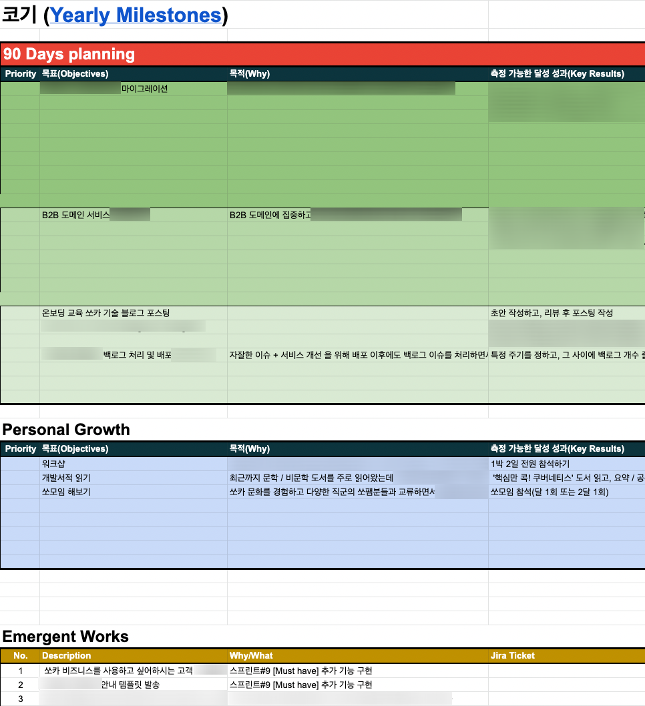
    <em>저(코기)의 3Q 90 Days Planning 작성한 내용</em>

<!-- 의 3Q 90 Days Planning 작성한 내용") -->
<!-- {: width="75%" height="75%" style="display: block; margin: 0 auto"} -->

저(코기)의 3Q 90 Days Planning 작성한 내용

(현재 저의 3분기 90 Days Planning 입니다. TL과 미팅하면서 확정짓고, 이를 실천하기위해 노력하고 있습니다!)

가장 인상깊었던 강의는 람다의 **‘프로그래머로 산다는 것'** 입니다. 제가 지금까지 컴퓨터를 전공하고, 개발을 해오면서 단순히 ‘잘하는 프로그래머' 가 되고 싶었는데, 이 강의를 통해 **‘좋은 프로그래머’** 로 성장해나가는 명확한 목표를 설정할 수 있었습니다. 덧붙여서, 단순히 개발만 잘하는 것 뿐 아니라 **지식 공유 및 협업** 을 위해 고민하고 실천해나가는 자세를 가지고 쏘카에서 열심히 해야겠다는 열의도 생기게 되었습니다. 

    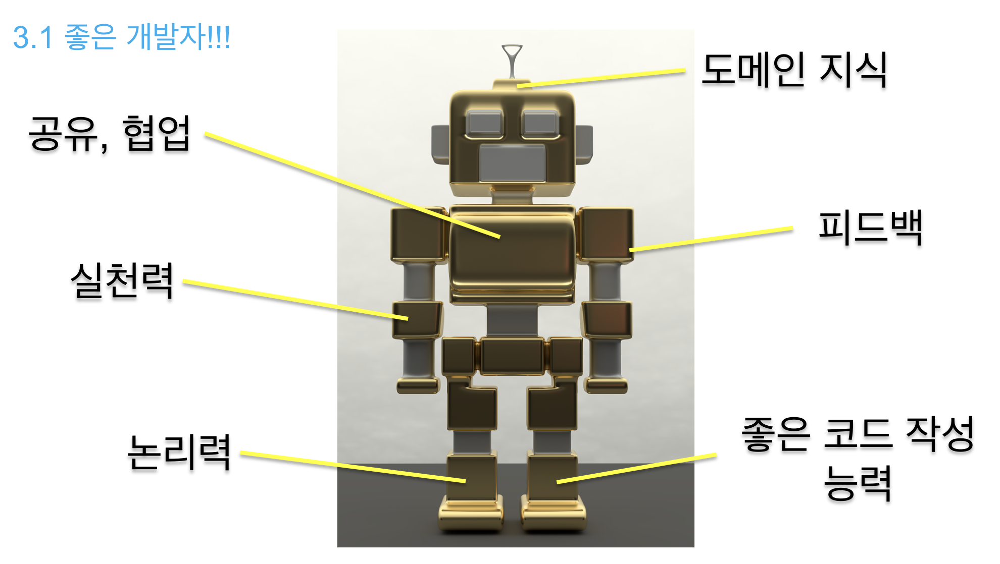
    <em>람다가 생각하는 '좋은 프로그래머'</em>

(위 슬라이드와 같은 능력들을 갖추면, ’좋은 프로그래머’ 가 될 수 있습니다?!)

### 2.2. 2 Week : Backend 강의 & 쏘카의 개발 문화

| 주제                                    | 내용                                                                                                          | 소속        | 강사         |
| --------------------------------------- | ------------------------------------------------------------------------------------------------------------- | ----------- | ------------ |
| Service Development Introduction        | 쏘카의 Service Repository 구조, 개발 환경(dev, qa/stage, production), 개발부터 배포까지의 과정을 소개합니다.  | Car Sharing | 믈브         |
| Backend - Running services in the local | 실제 운영중인 쏘카 서버의 repository를 받아 local 환경에서 실행하기 위한 과정을 환경설정과 함께 실습해봅니다. | Car Sharing | 믈브         |
| Github and PR and Reviewing             | 쏘카의 Github 관리 및 협업(PR / Code Review / Merge) 방식을 듣고 실습하는 시간입니다.                         | Car Sharing | 믈브         |
| Backend - Coding: convention and styles | Kotlin 기본 코딩 가이드 및 intelliJ plugin(+ gradle) 활용 방법을 설명합니다.                                  | Car Sharing | 믈브         |
| Backend - Tests and testable code       | 테스팅에 대해 배우고, 실습을 통해 테스트 코드를 작성해봅니다.                                                 | B2B         | 카이         |
| Homework                                | 쏘카 서버의 Repository에서 서비스 하나를 선택해서 Test code 작성 / PR / Code Review 해보기.                   |             |              |
| Backend - CI/CD                         | 품질관리 및 배포/운영까지 함께하는 CI/CD와 쏘카는 어떤 방식인지 설명합니다.                                   | Marketing   | 도가, 브루스 |
| Backend - Datadog & Monitoring          | 쏘카 서버를 모니터링하고 관리할 수 있는 Datadog, 그 외 모니터링 도구에 대해 설명합니다.                       | Marketing   | 도가, 브루스 |
| Backend - Performance testing           | 내가 만든 서비스가 얼마까지 버틸 수 있는지 알기 위해 수행하는 Performance Testing을 배웁니다.                 | Marketing   | 도가, 브루스 |

일주일이 지나고, 2주 차 교육이 시작되었습니다.

이번 주는 본격적으로 Backend 기술 관련 강의가 많았습니다. 쏘카에서 어떻게 협업하는지, 어떠한 방식으로 개발 및 배포까지 이뤄지는지 쏘카의 개발문화도 알게 되었습니다. 이와 더불어 개발 환경 설정까지 진행했는데, 그 덕분에 이론으로 배운 것을 실제로 연습해보는 Homework 까지 할 수 있었습니다. 그래서 더 빠르게 흡수할 수 있었다고 생각합니다.

가장 흥미로웠던 강의는 **‘Backend - Datadog & Monitoring’** 과 **‘Backend - Performance Testing’**, 마지막으로 **‘Backend - Tests and testable code’** 였습니다. 

    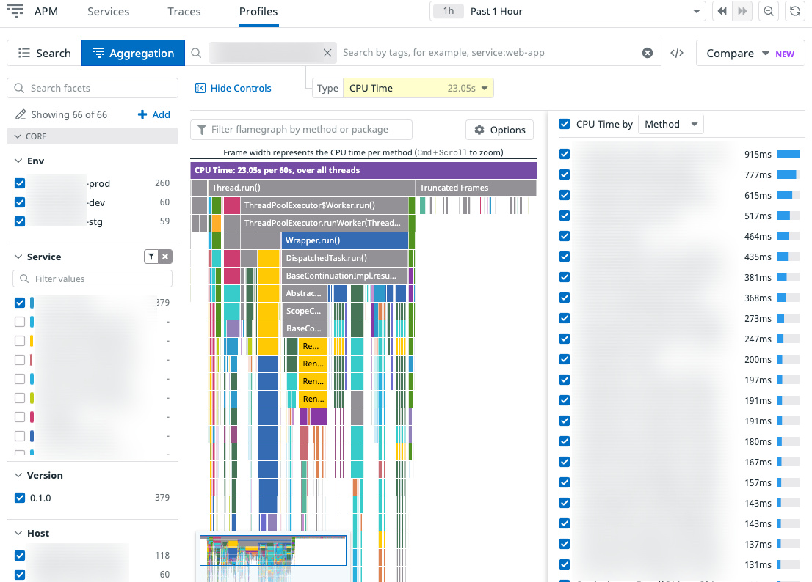
    <em>Socar의 Datadog Profiling 일부 화면</em>

지금까지 `Datadog` 이란 모니터링 도구를 알아두기만 했고 실제 활용했던 경험은 전무했었는데, 쏘카에 와서 직접 경험해볼 수 있는 좋은 기회였다고 생각합니다. 그래서인지, 도가가 해주신 Datadog 강의를 통해 쏘카 서버 전체를 관망하는 대시보드, Error 발생 시 Slack / opsgenie 툴과 연동해서 alert을 받을 수 있는 Monitor, 그 외 쿠버네티스의 POD도 확인할 수 있는 기능 등 다양한 datadog 사용법을 알게 되었다는 점이 무척 뜻깊었습니다.

    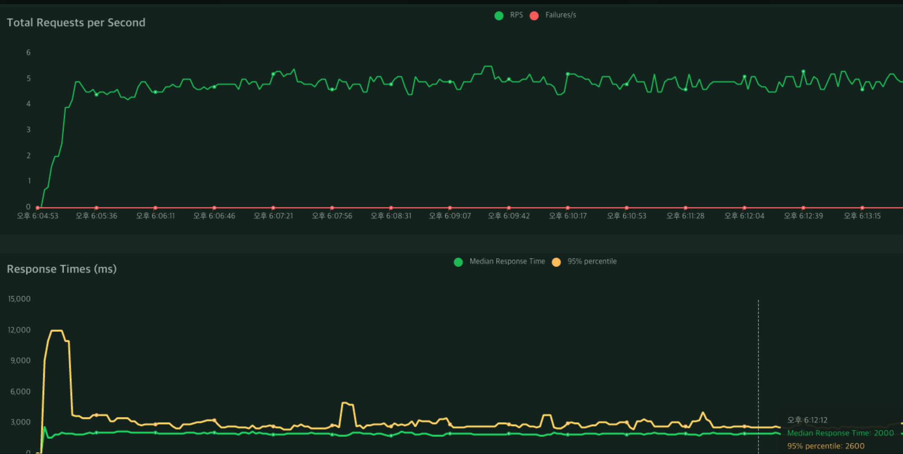
    <em>Locust를 활용해 테스트했던 결과 지표</em>

다음으로, 저는 이전까지 Unit test & Integration test 만 해봤었는데, `Locust` 를 이용한 Performance testing을 통해 실제 내가 만든 서비스가 쏘카 서버에서 버틸 수 있는지, 트래픽을 얼마까지 받아낼 수 있는지 등 성능을 측정해볼 수 있어 흥미로웠습니다. 특히, 배운 원리와 기능을 직접 눈으로 확인할 수 있어 무척이나 좋았던 시간이었습니다.

마지막으로, **‘Backend - Tests and testable code’** 강의는 TDD 방식 및 테스트코드 작성의 중요성을 다시금 상기시키게 해준 의미있는 강의였다고 생각했습니다. 특히 JUnit 의 변천사도 설명해주시고, ‘**백각이 불여일행’** 이란 말처럼 실제 쏘카에서 사용하는 컨벤션에 맞게 Unit test & Integration test 를 만들어보며 빠르게 습득할 수 있었습니다.

### 2.3. 3 Week : Frontend 강의 & 쏘카 Infra / DB 

| 주제                                     | 내용                                                                                         | 소속          | 강사   |
| ---------------------------------------- | -------------------------------------------------------------------------------------------- | ------------- | ------ |
| Frontend - Coding: convention and styles | Backoffice 개발 역량을 위한 FrontEnd 기본 코딩에 대해 설명합니다.                            | Web팀         | 라파엘 |
| Frontend - Package management            | npm이 무엇인지 설명하고, FrontEnd의 공통 npm module 사용법을 실습합니다.                     | B2B           | 블랑   |
| Frontend - Running services in the local | local 환경에서 Backend 서비스와 직접 실행해 연동하고, 결과를 확인해보는 실습하는 시간입니다. | Car Sharing   | 리스본 |
| Frontend - CI/CD                         | FrontEnd의 CI/CD에 대해 설명을 듣고, 개발부터 코드리뷰 / 배포까지 직접 실습하는 시간입니다.  | Marketing     | 버틀러 |
| AWS and GCP in SOCAR                     | AWS와 GCP를 쏘카에서는 어떻게 활용하는지 소개합니다.                                         |               | 에코   |
| (Kubernetes) How to use in SOCAR         | Kubernetes(K8S) 의 기본 개념과 원리에 대해 설명을 듣고, 실습을 통해 명령어를 익힙니다.       | Core Platform | 코알라 |
| SOCAR Network                            | 쏘카 서버의 Network Architecture에 대해 소개합니다.                                          | Cloud Infra팀 | 로원   |
| SOCAR Database structure                 | AWS RDS를 활용하는 쏘카의 Database Architecture에 대해 소개합니다.                           | Cloud DB팀    | 제이든 |
| DB - SQL Basic Grammar                   | 실제 쏘카에서 활용하는 SQL 문법을 보고 작성해보는 시간입니다.                                | Cloud DB팀    | 알티   |

마지막 3주 차 교육은 FrontEnd 관련 강의가 절반을 차지했는데, 서버 개발자라고 해서 BackEnd 만 알고 있는 것보다 쏘카에서의 FrontEnd 개발 문화도 알아두는 것이 이후 협업에 있어 큰 도움이 될 것이라고 판단해서 전부 수강했습니다. 쏘카에서 FrontEnd 개발은 주로 `react`, `typescript` 를 사용하는데, 이전에 Vue.js를 사용해본 경험이 있어 이해하기 한결 수월했고 관심있게 수강했습니다.

이렇게 총 3주간의 온보딩 교육 수강이 끝나고, ~~(쉴틈없이)~~ 다음 온보딩 과정인 **‘Dogfooding Project’** 를 시작하게 되었습니다! 💪

## 3. Dogfooding Project

---

### 3.1. Dogfooding?

대략 3주 간의 개발 / 기술 교육을 마친 후에 저희 4명이 한 팀을 이뤄 프로젝트를 수행하게 됩니다. 소위 ‘Dogfooding Project’ 라고 불리는 이 용어에서 ‘**Dogfooding**’ 의 의미를 찾아봤습니다.

<aside>
👉 Eating your own dog food, also called dogfooding, is a slang term used to reference a scenario in which a company uses its own product to test and promote the product.

출처 - wikipedia

</aside>

즉, **‘자사의 제품(소프트웨어)을 직원들이 직접 사용 해보고 개선시키는 것’** 을 뜻합니다.
다시 정리하자면, 이 프로젝트를 수행하는 취지는 크게 세 가지 입니다.

- 피드백을 통해 소프트웨어 개발 기술을 객관적으로 측정하고 성장할 수 있어서.
- 쏘카의 서비스를 파악하고, 개선점을 찾아 더욱 서비스를 발전시키기 위해서.
- 실제 쏘카 서비스에 상용화되기 때문에 프로젝트에 대한 열정과 동기가 생기고, 몰입할 수 있어서.

저희가 수행하는 프로젝트의 명칭은 ‘**RFC103 - CDN 및 업로드 관리’** 입니다.

(RFC는 Request for Comments 의 약자로, 새로운 연구 / 기술 / 서비스를 작성하고 동료들에게 공유하며 의견을 받기위한 문서를 뜻합니다. 이렇게 받은 의견을 바탕으로 문서를 발전시키며, 최종 승인된 문서는 더이상의 수정이 불가능하고 공식적인 표준 가이드로 활용됩니다.)

이 프로젝트의 목적은 하단에 작성한 As-Is 를 To-Be 로 개선하기 위해 제안되었습니다.

- As-Is : 현재 외부로의 노출 또는 제공이 필요한 디지털 에셋(이미지, PDF파일 등)을 제공하는 일관된 방식이 존재하지 않은 상황입니다.
- To-Be : **디지털 에셋을 관리하는 독립적인 시스템을 구축**하여 정해진 규칙과 규격에 맞게 관리할 수 있습니다.

    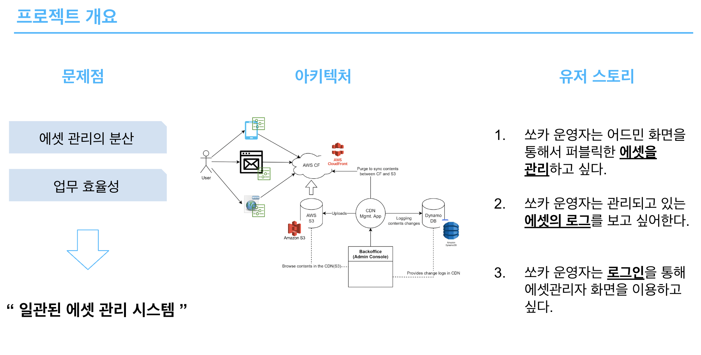
    <em>‘RFC103 - CDN 및 업로드 관리’ 프로젝트 목표</em>

**애자일 방식으로 1주 단위의 스프린트 3회에 걸쳐 총 3주 간 진행**된 이 프로젝트의 결과부터 말씀드리자면, **최종 데모까지 성공적으로 마무리했습니다.** 👏👏👏

### 3.2. Kick-Off 미팅

프로젝트 일정 첫 날 오전에는 **Dogfooding 사전 미팅**을 통해 작성자인 아나킨에게 전체적인 설명을 듣고, 오후 내내 **Kick-Off 미팅**을 가졌습니다.

첫 날 당시 프로젝트 개요와 RFC문서를 보고, 직접적인 도움 없이 제로(0)부터 시작해서 만들어야한다는 점이 가장 큰 압박과 부담이었습니다. 그렇지만, 온보딩 교육과 스터디를 통해 근거있는 자신감이 있었고, 서로 다같이 힘을 합친다면 성공적으로 마칠 수 있다는 열의가 생겼었습니다. 

**Kick-Off 미팅** 에서 제일 중점으로 둔 부분은 **‘협업을 위한 프로젝트 싱크업'** 인데요. 서로가 똑같이 프로젝트에 대해 이해하고 목표를 수립해야 협업에 있어 원활하게 진행할 수 있다고 생각했습니다. 아래와 같은 세 가지 아젠다를 가지고 미팅을 진행했습니다.

1. 구현해야할 기능을 RFC 문서에서 도출하여 유저 스토리를 작성하고, 스토리 별 FrontEnd / BackEnd 필요한 개발 사항을 정리했으며, 프로젝트 성공 목표와 함께 프로젝트 싱크업을 했습니다.
2.  언어 / 프레임워크 / 라이브러리 뿐 아니라 서버 환경 구성 및 시스템에 필요한 AWS 서비스를 리스트업 했습니다. (모두가 참여해 FrontEnd 와 BackEnd를 구분해서 리스트업 했습니다.)
3. 주어진 일정을 파악하여 전체적인 플래닝을 세웠고, 스프린트 단위 선정 및 스프린트 별 목표를 설정했습니다.

(FrontEnd 기술 관련해서 내용을 추가하지 못했습니다. 정도로)

BackEnd는 현재 쏘카 전반적으로 사용하고있는 언어인 ‘Kotlin’ 과 ‘Spring Boot’ 프레임워크를, FrontEnd는 ~ 를 사용했습니다.

이에 더해, 디지털 에셋을 저장하기 위해 `AWS S3`, 디지털 에셋을 표면적으로 노출시키기 위해 `AWS CloudFront`, 업로드 / 삭제 와 같이 디지털 에셋의 변경 이력을 기록해두기 위해 `Amazon DynamoDB` 를 사용하기로 결정했습니다. 저로서는 실무에서 처음 접해보는 AWS 이기 때문에, 퇴근 후에 개인적으로 공부하며 이를 활용할 수 있게 노력했습니다.

### 3.3. 프로젝트 진행

이후에는 첫 날에 협의한 일정대로 프로젝트를 진행했습니다.

Jira에서 스프린트를 생성했고, 각자 맡은 업무를 티켓으로 만들면서 주도적으로 개발했습니다. 그리고, 매일 정해진 시간에 데일리 스크럼을 하면서 두 가지를 공유했습니다. 한 가지는 전날 했던 업무와 오늘 하는 업무를 공유하는 것, 다른 한 가지는 노션 문서에 기록해둔 개발 관련 협의가 필요한 사항을 공유하는 것이었습니다. 

대표적으로 코딩 컨벤션, 프로젝트 구조 설계, 유저 시나리오, API 명세, CI/CD 환경설정이 있었습니다. 스크럼 이후 미팅할 시간을 정한 후, 미팅 때 각자 가지고 있는 지식과 경험을 자유롭게 공유하며 가장 효율적이고 최적의 방안을 도출해냅니다. 물론, 미팅마다 회의록 및 협의 결과를 노션 문서에 기록합니다.

이후에는 각자 주어진 서비스를 개발해나갔습니다. 책임진 서비스는 다음과 같습니다.

- 코기 - Backend
    - AmazonS3 생성 / Configuration, Component 구현 및 Amazon S3 연동
    - 에셋 파일 S3 임시 버킷에 업로드, 임시 버킷 → 에셋 버킷으로 파일 COPY
    - git action / husky / ktfmt 설정
- 이누 - Backend
    - 초기 프로젝트 설정 / 인터페이스 구현 / Exception Handling
    - Controller, DTO 구현
    - 에셋 파일 삭제
    - 로그 조회
- 키이라 - Backend
    - DynamoDB / CloudFront 생성 및 연동
    - 에셋 파일 조회
    - DynamoDB 활용해서 로그 저장
    - Testcontainer, Localstack 모듈 구현
- 도시 - Frontend
    - Wireframe 작성
    - FrontEnd 개발환경 구현
    - 디자인 토큰 정의 및 설정
    - UI 단위 컴포넌트(Button, Typography, FlexBox, Divider, Modal 등) 및 관련 기능 구현

저희 모두 테스트코드 작성에 진심이었기 때문에, 작업 기간 중 절반은 거의 테스트코드 작성에 할애했습니다. Unit test 관련해서 Service는 `kotest` 의  *`AnnotationSpec`* 을, Controller는 `MockMvc` 를 사용했습니다. 이에 더해 AmazonS3 Integration Test를 위해서 `Testcontainer` 로  `Localstack` 모듈을 사용하기도 했습니다.

### 3.4. 스프린트 데모

이렇게 정신없이 첫 스프린트를 마친 후 `스프린트 데모`와 `스프린트 회고 및 플래닝` 시간이 되었습니다.

총 3번의 데모를 통해 아래 리스트와 같이 정의했던 **프로젝트의 인수조건(Acceptance Criteria)** 에 대한 개발을 시연했습니다. 데모 시연은 도시가 http://localhost 환경에서 진행해주셨습니다.

(하지만, 시간적 / 역량적인 한계로 상세한 인수조건을 전부 충족하지 못했습니다..)

- 쏘카 운영자는 Admin Website를 통해 Public한 디지털 에셋을 관리하고 싶다.
    - ‘디지털 에셋 관리 화면’ 에서 업로드한 에셋 파일을 볼 수 있어야 한다.
    - 에셋 파일을 미리보기로 볼 수 있어야 한다.
    - 에셋 파일을 업로드 할 수 있어야 한다.
    - 에셋 파일을 검색할 수 있어야 한다.
    - 에셋 파일을 삭제할 수 있어야 한다.
    - 에셋 파일을 담는 폴더(디렉토리)를 생성할 수 있어야 한다.
- 쏘카 운영자는 파일의 history를 저장한 log를 보고싶어한다.
    - 운영자는 에셋 파일의 변경(생성, 삭제) 이력과 변경한 사람 / 변경일자 / 변경사유 에 대해 알 수 있다.
    - 운영자는 전체 log에 대해 날짜 기준으로 조회할 수 있다.

첫 데모 당시에는 처음이다보니 많이 긴장했고 떨렸지만, 시연 뿐 아니라 서비스 추가 및 개선 관련 질문을 받고 대답하는 QnA 시간까지 무사히 마칠 수 있었습니다.

    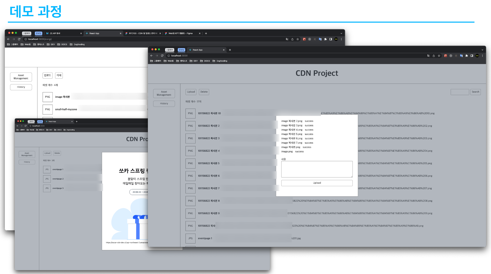
    <em>스프린트 데모 시연 중 일부 스크린샷</em>

### 3.5. 회고 및 플래닝

데모 다음 날, 스프린트 회고 및 플래닝을 진행했습니다. 스프린트 회고 방식은 `KPT 회고 방식` 을 도입했는데, 간단하게 설명드리자면, **Keep / Problem / Try 의 앞 글자를 따서 만들어진 회고 방식**입니다. 

<aside>
💡 KPT 회고란 ?

**Keep / Problem / Try 의 세 가지 관점으로 분류하여 회고를 진행하는 회고 방법론**입니다.

- Keep - 잘하고 있는 점 또는 이대로 유지했으면 좋겠다고 생각되는 점
- Problem - 문제라고 생각되는 점 또는 개선했으면 하는 점
- Try - 잘하고 있는 것을 유지하기 위한 방법 또는 문제를 해결하기 위한 방법
</aside>

    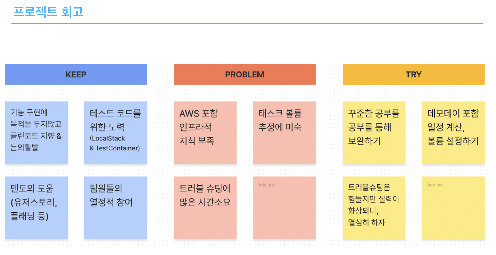
    <em>자체적으로 수행한 KPT 회고</em>

이처럼 스프린트를 진행하면서 느꼈던 Keep, Problem, Try 를 스프린트 참여자들이 포스트잇에 작성하고 이를 공유하며 토론을 통해 내용을 개선했습니다. 이후 투표를 통해 다음 스프린트에 수행할 **Action Item을 선정**하는데, 회고의 사회자가 다음 스프린트 기간동안 Action Item을 잘 수행하는지 감독하게 됩니다.

저희 모두 처음해보는 회고 방식이어서 각자 길게 나열하고 이를 공유했었습니다. 그만큼 반나절을 회고하는데 사용했습니다. 퇴근 시간이 가까워질 때가 되서야 위와 같이 간결하게 정리하고 마칠수 있었습니다.

이렇게 시행착오를 한 번 거치고 난 다음 회고에서는 **소요시간은 줄이고 회고 목적에 맞게 적합한 Item을 도출해내는** 노하우가 생겼고, 이는 이후 버킷에서 진행한 스프린트 회고에 있어 큰 도움이 되었습니다.

이렇게 이전 스프린트 회고를 마치고, 바로 다음 스프린트를 위한 플래닝을 진행했습니다.

    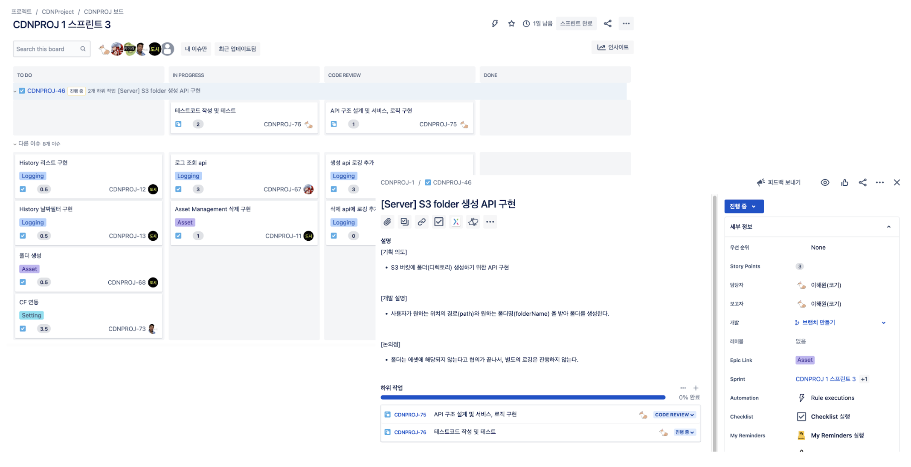
    <em>Jira에서 sprint 보드를 만들어 함께 티켓 생성하고 협의하는 플래닝 모습</em>

처음 작성했던 유저 스토리를 바탕으로 스프린트 업무 범위를 구체화한 후, 티켓을 함께 생성하며 업무 분배를 했습니다. 이 때, 각 티켓 별로 Story Point 를 산정합니다. 지라 티켓에서의 Story Point는 **‘해당 티켓을 완료하는데까지 걸리는 노력(시간, 난이도 등)의 총합’** 을 의미합니다. 각자 생각하는 Story Point를 공유하고, 최종 Story Point를 확정합니다.

이러한 프로세스로 스프린트를 해나갔고, 스프린트 도중에 하게 된 모든 미팅과 회고 / 플래닝 은 충분한 시간을 두고 진행했습니다. 그 이유는, 동료 중 어느 한 명이라도 불만이 생기지 않고, 하고싶은 이야기를 다 할 수 있게 하기 위해서입니다. 그 결과로 프로젝트 기간동안 감정이 격해지거나 분위기가 나빠지지 않고 성공적으로 마무리할 수 있었습니다.

## 4. (설마) 교육만 하나요??

---

당연히! 교육만 듣고 개발 공부만 하지 않았습니다. 저희 온보딩팀도 참여할 수 있는 활동이 여러가지가 있습니다만, 가장 기억에 남는 세 가지 활동에 대해 소개하려고 합니다.

### 4.1. 서비스 엔지니어링 본부 타운홀미팅 자기소개

서비스 엔지니어링 본부에서는 매 달 말일에 한 시간 정도 모두가 모여 서로 인사하고 정보 / 기술 / 성과도 공유하는 자리가 있습니다. 이를 **‘서비스 엔지니어링 본부 타운홀미팅'** 이라고 부르는데요. 매 회차마다 정해진 첫 세션이 있습니다. 바로! **‘신규 동료 소개’** 세션입니다. 간단하게 저에 대한 소개 자료를 PPT 1페이지 분량으로 준비해서 ‘**자기PR’** 하는 시간입니다.

    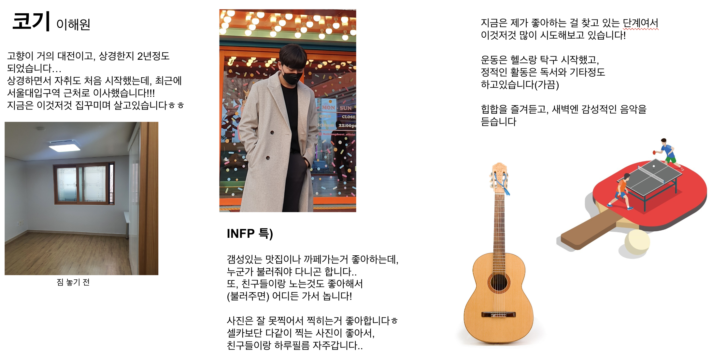
    <em>‘코기’ 는 이런 사람입니다.</em>

이렇게 마련해주신 세션 덕분에 서비스 엔지니어링 본부 동료분들에게 **‘코기’** 에 대해 알릴 수 있는 기회가 되었고, 다들 뜨거운 박수와 환호로 맞이해주셨습니다. (질문도 엄청 해주셔서 QnA 타임이 되었습니다..)

특히, 들었던 말 중 **‘쏘카에 입사한 것을 진심으로 환영하고, 축하한다.’** 는 따뜻한 말이 지금까지도 가슴 속에 자리잡고 있습니다. 이러한 세션 덕분에 동료들과 더욱 가까워졌고, 회사 또한 빠르게 적응할 수 있었습니다. 

### 4.2. 서비스 엔지니어링 본부 쏘풍데이

2022년 올 해부터 추진한 **‘서비스 엔지니어링 본부 쏘풍데이’** 에 참여할 수 있게 되었습니다. 벚꽃이 피고 화창한 계절인 봄, 4월에 진행되었는데, **‘쏘카 회사의 적응 및 동료 간의 친목도모’** 의 취지에 맞게 다른 팀의 동료분들과 하루종일 식사하고, 액티비티 활동을 하면서 더욱 가까워졌다고 생각합니다. 

이 날에는 업무를 하지 않고 쏘풍데이에 집중할 수 있는 분위기와 환경을 조성해주기 때문에, 잔업에 대해 신경쓰지않고 편하게 시간보낼 수 있었습니다. 인원 수 차이가 나지 않게 랜덤으로 조를 편성했고, 각 조 별로 어떤 활동을 하면 좋을지 슬랙 채널을 통해 이야기하며 정했습니다.

저희 조는 브런치 → 영화 → 볼링 → 북까페 코스로 활동을 기획했습니다.

(다른 조는 양평 두물머리 드라이브, 강원도 바다멍 여행, 남양주 물의정원, 낙산공원과 연극 등 다양한 활동을 했다고 합니다.)

    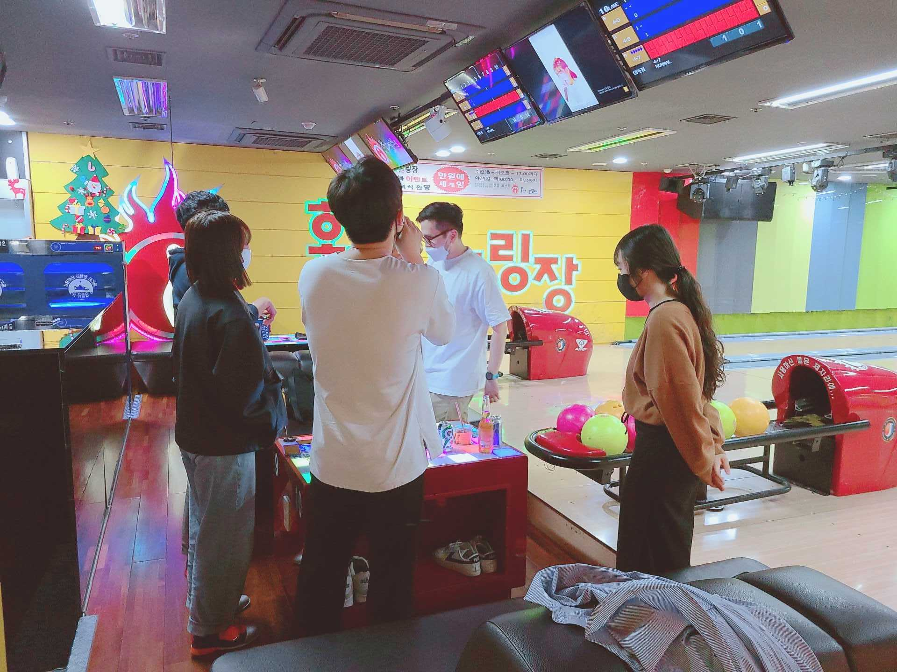
    <em>쏘풍데이 중 볼링치는 모습</em>

볼링을 처음 친다는 걱정 없이 모두가 편하고 즐겁게 시간을 보낼 수 있었습니다.

이런 날을 제공해준 쏘카 덕분에 잊지못할 추억을 하나 간직할 수 있었고, 하반기에도, 내년에도, 다른 본부랑도 쏘풍데이를 함께하면 좋겠다는 생각이 드는 날이었습니다.

### 4.3. 스터디

쏘카에서는 다양한 주제로 자유롭게 스터디를 만들어 진행할 수 있습니다. 저는 온보딩 기간에 개인적으로 `kotlin in action` 책을 혼자서 공부하다가, 버킷에 배정받은 이후에는 MSA 스터디에 참여하여 동료들과 함께 `마이크로서비스 도입, 이렇게 한다.` 책으로 공부하고 있습니다. 

    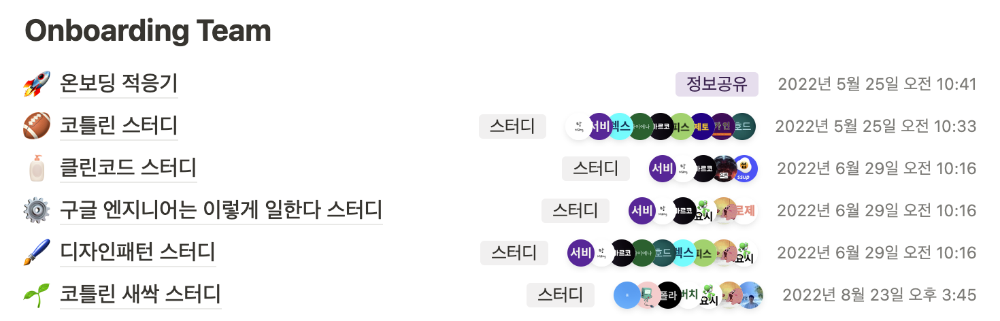
    <em>노션 문서에 작성한 온보딩팀 스터디 진행 리스트</em>

## 5. 온보딩 졸업 후 각자 버킷으로.

---

프로젝트 최종 데모를 끝으로 모든 온보딩 교육 일정을 마쳤습니다. 이후 티타임을 가지면서 각 버킷에 대해 어떠한 서비스와 프로젝트를 진행하는지 소개를 듣고, 희망하는 버킷을 3순위까지 작성했습니다. 한 가지 아쉬운 점은, 마음속에 원하는 버킷이 생겼다고 해도 다른 버킷의 인원이 해당 버킷의 인원보다 적거나, 업무 범위나 중요도가 높아  추가 인원이 필요한 경우 TO가 나게 되고, **TO가 나온 버킷에만 희망이 가능**했다는 것입니다.

이렇게 희망한 버킷과 각 버킷 별 TL분이 희망하시는 순위를 비교하여 최대한 반영될 수 있도록 EM유닛의 케이제이가 조율해주셨습니다.

그렇게 저는 제가 희망했던 B2B 버킷에 배정받았습니다. ~~동기들 또한 희망한 버킷에 배정받았는지 흡족해 했습니다.~~ 이후 서로 모르는 부분이라던지, 다른 버킷의 서비스와 연관된 기능을 개발한다던지 하는 경우가 발생했을 때에 편하게 교류하며 각자의 버킷에서 주어진 서비스를 개발할 수 있었습니다. 이는 모두 온보딩 교육이 있었기에 지금이 있지 않았나 생각이 듭니다.

## 6. 나날이 발전하는 온보딩 교육

---

이 글을 작성하면서 EM유닛의 케이제이, 티타임을 가지며 가까워진 신규 입사자분들에게 자문을 구하기도 했습니다. ~~특히 기간적인 측면에서 개인적으로 Dogfooding Project 수행기간이 짧다고 느꼈었는데,~~  그러면서, 쏘카의 온보딩 커리큘럼은 피드백을 통해 지속적으로 개선되고 있다고 들었습니다. 그 중 Dogfooding Project 수행기간이 짧다는 피드백을 반영하여 현재는 **Dogfooding Project를 2달 가까이 진행**하고 있으며, 기존의 강의 퀄리티 개선과 함께 아래 표로 작성한 강의들이 추가되었다고 합니다.

| 주제                                | 내용                                                                           | 소속               | 강사   |
| ----------------------------------- | ------------------------------------------------------------------------------ | ------------------ | ------ |
| CITY DILEMMA : 쏘카 다큐멘터리 시청 | 쏘카가 추구하는 방향과 지금까지 달려온 여정을 담은 다큐멘터리를 시청합니다.    |                    |        |
| 차량 시뮬레이터 온보딩              | 본부 별 차량 시뮬레이터 체험 & 교육                                            | 커넥티드디바이스팀 | 라네   |
| Modern Architecture 1, 2            | 아키텍트의 역할과 아키텍트는 어떻게 만들어지는지에 대한 이야기를 전해드립니다. | SE 본부장          | 아나킨 |
| 당신이 모르던 코틀린                | 코틀린에 대한 기초 및 심화 교육                                                | 외부강사           | 오현석 |

## 7. 나에게 온보딩 교육이란?

---

저와 함께 우당탕탕했던 동기들에게 온보딩 교육 관련해서 Q&A 하는 인터뷰를 진행해봤습니다.
(인터뷰 질문에 성실히 대답해주셔서 감사합니다!)

**Q. 나에게 있어 쏘카의 온보딩 교육이란?**

**코기** : 쏘카에 동화되어 진정한 쏘카 일원으로 합류하게 만들어 주었습니다. 또한, 온보딩 교육이 없었다면 평생 갈 소중한 동기를 얻지 못했을 것이라고 생각합니다.

**이누** : 쏘카에 자연스럽게 적응할 수 있는 따뜻하고 즐거운 시간이었습니다.

**키이라** : 쏘카 문화에 스며들고, 쏘카의 기술들을 천천히 살펴볼 수 있는 시간 뿐 아니라 나에게 필요한 것들을 파악하고 준비할 수 있는 시간이었습니다. 이에 더해, 동기 및 쏘카 동료들과 친해질 수 있는 시간이었습니다.

**도시** : 쏘카 문화에 적응하며 동료들과 밍글링(Mingling) 할 수 있는 즐거운 시간이었습니다.

**Q. 온보딩 교육을 통해 어떤 도움을 받았나요?**

**코기** : 온보딩 교육 이후 저의 직업을 ‘백엔드 서버 개발자’ 라고 자신있게 소개할 수 있었습니다. 그만큼 더 깊고 전문적인 지식과 경험을 쌓는데 발판을 마련해줬고, ‘넌 쏘카에서 충분히 잘 해낼 수 있는 사람' 이라는 생각을 자리잡게 해주었습니다.

**이누** : 체계적인 개발 수업을 들으며 개발자로서의 기반을 닦을 수 있었습니다. dogfooding 프로젝트를 하며 쏘카 내에서의 협업은 어떻게 이뤄지는지, 이슈가 발생했을 땐 어떻게 핸들링해야 하는지, 개발 및 업무 진행에 있어 도움은 어떻게 받을 수 있는지 등 을 배울 수 있었습니다. 가장 큰 건 무엇보다 소중한 동기들을 얻은 것입니다.

**키이라** : 쏘카가 추구하는 개발 방향에 대해 전반적으로 파악할 수 있었고, 무엇보다 dogfooding 프로젝트를 진행하면서 협업 방식과 의사소통 방식을 배울 수 있었습니다. 이는 각자 버킷에 배정된 이후에도 빠르게 적응할 수 있는 기반이 되었다고 생각이 듭니다.

**도시** : 쏘카의 개발문화와 추구하는 가치를 체계적으로 알 수 있었고, 여러 분야의 전문가 분들에게 직접 관련 지식과 경험을 배울 수 있던 점이 저에게 많은 도움이 되었습니다.

**Q. 가장 인상깊은 온보딩 교육은 어떤 것인가요?**

**코기** : 교육받는 모든 순간의 기억과 인상이 남아있습니다.

**이누** : 모든 교육이 개성있고 유익했습니다.

**키이라** : 음.. 온보딩 기간동안 협업 방법, Architercing Model, CI/CD, 서버 모니터링, Test code 등의 강의 수강과 dogfooding 프로젝트를 진행했었습니다. 사실 이러한 온보딩 프로세스가 존재하고, 체계적으로 구성되어있다는 것에 굉장히 만족했었습니다. 또한, 실제로도 해당 교육 내용들이 이후에 팀에서의 적응을 수월하게 해주었습니다.

이 중 가장 인상깊었던 교육을 꼽자면 `dogfooding 프로젝트` 인 것 같습니다. 직접 경험해보는 것만큼 이해가 잘되는 것은 없으니까요. 프로젝트 과정을 통해서 실제로 쏘카에서 쓰이는 기술들을 미리 찾아보고 적용해볼 수 있었던 시간이어서 많은 도움이 되었습니다. 마지막으로, 동기들과 같이 진행했던 프로젝트가 현재 저희 버킷(Marketing Bucket) 담당으로 넘어왔는데, 고도화 후 쏘카 서비스에 얼른 적용시켜보고 싶습니다.

**도시** : 함께 3월에 입사한 동기들과 함께 진행한 `dogfooding 프로젝트`가 가장 기억에 남습니다. 이 프로젝트를 진행하면서 온보딩 강의로 배웠던 쏘카의 애자일 문화를 실제로 사용해볼 수 있었고, 이후에는 실제 쏘카에서 사용하기 위한 목적이었어서 쏘카와 관련된 도메인 지식을 익힐 수 있었습니다.

**Q. 그렇다면, 현재 배정받은 버킷에서 업무를 하는데 있어 가장 크게 도움되었다고 생각되는 강의와 그 이유가 궁금합니다.**

코기 : 저는 도가와 브루스가 강의해주신 `Backend - CI/CD 및 Datadog & Monitoring` 강의가 가장 도움되었다고 생각합니다. 본문에서 이유를 작성하긴 했지만, 추가로 덧붙이자면 현재 B2B 버킷의 서비스를 모니터링하는 **Datadog Monitor 및 opsgenie 구성을 수월하게 할 수 있는데** 도움이 많이 되었습니다.

이누 : 카이가 해주신 `Backend - Tests and testable code` 강의가 실무에서 가장 유용한 것 같습니다. 직접 테스트코드를 짜면서 비즈니스 로직을 파악하고 어떤 상황에서 에러처리를 해야 하는지 꼼꼼하게 배울 수 있었습니다.

키이라 : 현재 속한 버킷에서 업무를 하는데 많은 도움이 되었던 강의는 크게 2개를 뽑을 수 있습니다. (한가지만 뽑으라고 하셨지만..)

- 첫번째는, `Backend - Runnning services in the local` 강의입니다. 이 강의에서 git 관련 설정부터 로컬에서 서버 띄워보는 작업까지 전부 진행했는데, 처음 슬라이드를 보고 설명을 들었을 때만해도 간단해보였습니다. 하지만, 처음 MacBook 환경 설정부터 시작해서 로컬에서 쏘카 서버를 띄울 수 있는 환경을 구축하기까지 함께 실습해보면서 만약 이 걸 혼자 했다면 무조건 헤맸을 거라는 생각이 들었고, 그와 함께 이 강의에 대한 고마움이 계속 기억에 남아있습니다.
- 두번째는, `Backend - Tests and testable code` 강의입니다. 이 강의에서는 테스트코드 종류부터 왜 테스트코드가 필요한지, TDD 등에 대한 설명과 실습을 수행했습니다. 입사하기 전 따로 프로젝트를 진행해 본 경험은 있었지만 프로젝트에 테스트코드를 활용해보지는 않았어서 해당 강의가 도움이 되었습니다. 또한, 현재 버킷에서 진행하는 업무의 대부분은 테스트코드 작성이 필수여서 이 강의를 통해 얻은 지식과 기술을 지금도 계속 사용하고 있기 때문입니다.

제가 백엔드 직무여서 그런지 직무와 관련된 강의들이 조금 더 인상깊었던 것 같습니다. 하지만, 돌이켜보면 온보딩 강의 중에 저에게 도움이 되지 않았던 강의는 하나도 없다고 생각합니다. 강의해주신 분들 모두 감사합니다! 😊

도시 : 저는 경력으로 입사하였지만 쏘카 프론트엔드 직무의 업무방식을 전부 이해하는 것은 아니었기 때문에 `프론트엔드 직무 관련 모든 강의`들이 업무를 이해하는데 도움이 되었던 것 같습니다. 

현재는 쏘카 프론트엔드 Core Platform Bucket의 Web팀에 소속되어 관련 업무를 하고 있는데, 온보딩 강의를 통해 저의 지금까지의 경험과 쏘카 프론트엔드 직무의 업무방식의 차이를 알 수 있었고, 더 나은 기술 및 개발 문화를 모색할 수 있는 기반을 만들어줬다고 생각합니다.

**Q. 새롭게 합류할 동료에게 해주고 싶은 이야기가 있다면?**

**코기** : Congratulation, SOCAR!

**이누** : 쏘카에 온걸 환영하고 같이 즐겁게 개발했으면 좋겠습니다! ☺️

**키이라** : 성장할 수 있는 회사, 워라벨이 좋은 회사를 찾으신다면, 쏘카에 만족하실 것 같아요~ 👍

**도시** : 애자일 문화, 개발문화, 개발자가 일하기 좋은 회사를 찾고 있다면 쏘카로 (당장) 오세요~!

## 8. 마치며..

---

같이 협업하고, 퇴근 후에는 교류하며 매일이 행복하게 만들어준 동기들에게 감사인사를 드리며, 고마움의 표시로 함께 카페에서 추억을 나눴던 사진을 첨부하며 글을 마무리하겠습니다.

    
    <em>(왼쪽부터 도시, 이누, 코기(저), 키이라)</em>

함께 우당탕탕한 동기들끼리 온보딩 이후에도 사이좋게 만나서 밥먹고 카페가고 음주도 즐기곤 합니다 😝

긴 글 읽어주셔서 감사합니다.